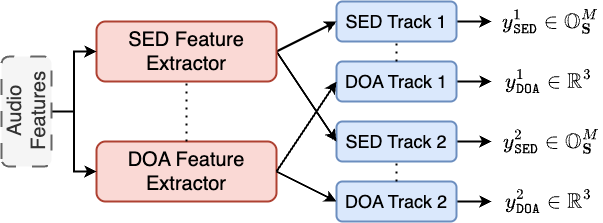
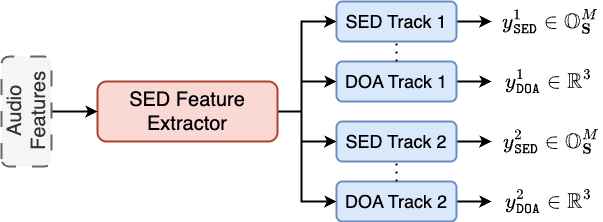
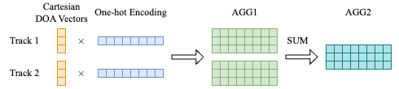
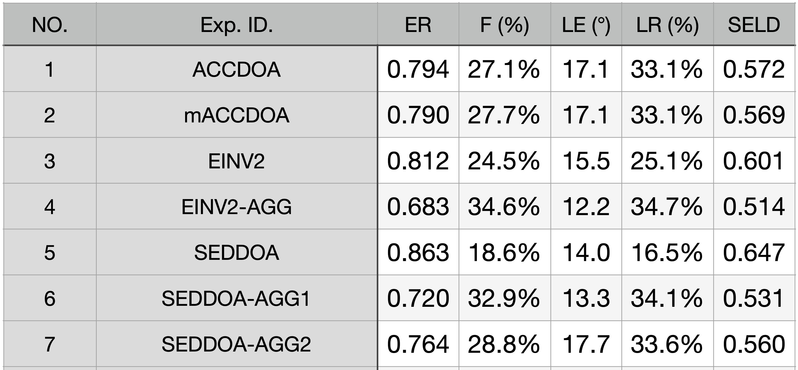

# Loss function design for sound event localization and detection based on multi-task learning

The track-wise multi-task learning approach exhibits significant efficacy in detecting overlapping sound sources for sound event localization and detection. However, as the number of predicted event classes increases, the track-wise multi-task networks often produce sparse outputs, resulting in missing alarms of sound events. To address this issue, we introduce an aggregated loss function, reformulating the multi-task learning framework into a single-task learning problem by coupling the activity of sound events with its Cartesian direction-of-arrival vector. Experimental results on a large-scale synthetic test set with 170 event classes demonstrate that the proposed method significantly improves the performance in sound event detection, effectively reduces the missing alarm rate, and achieves substantial improvement in localization and trajectory tracking.

## Network Architectures

### EINV2 (Dual branch)

<p align="center">

</p>

### SEDDOA (Single Branch)

<p align="center">

</p>

## Loss Functions

### Aggregated Loss

Coupling the activity of sound events with its Cartesian direction-of-arrival vector in loss functions.

<p align="center">

</p>

1. mACCDOA[3]-like (AGG1) loss:

```math
\mathcal{L}_{\mathrm{AGG1}}(t)=\min _{\alpha \in \mathcal{P}(t)} \sum_i \ell\left(\mathbf{y}_{\mathrm{SED}}^i(t, \alpha) \cdot \frac{\mathbf{y}_{\mathrm{DOA}}^i(t, \alpha)^{\mathrm{T}}}{\left\|\mathbf{y}_{\mathrm{DOA}}^i(t, \alpha)\right\|},\ \mathbf{y}^i\right)
```

The track-wise model needs to use permutation invariant training[1]. $\alpha$ indicates one of the possible permutations.

3. ACCDOA[2]-like (AGG2) loss:

```math
\mathcal{L}_{\mathrm{AGG2}}(t)=\ell\left(\sum_i \mathbf{y}_{\mathrm{SED}}^i(t) \cdot \frac{\mathbf{y}_{\mathrm{DOA}}^i(t)^{\mathrm{T}}}{\left\|\mathbf{y}_{\mathrm{DOA}}^i(t)\right\|},\ \mathbf{y}\right)
```

## Result

<p align="center">

</p>

## Reference

[1] Y. Cao, T. Iqbal, Q. Kong, F. An, W. Wang, and M. D. Plumbley, "An improved event-independent network for polyphonic sound event localization and detection," in Proc. IEEE Int. Conf. Acoust., Speech Signal Process., 2021, pp. 885–889.

[2] K. Shimada, Y. Koyama, N. Takahashi, S. Takahashi, and Y. Mitsufuji, "ACCDOA: Activity-coupled cartesian direction of arrival representation for sound event localization and detection," in Proc. IEEE Int. Conf. Acoust., Speech Signal Process., 2021, pp. 915–919.

[3] K. Shimada, Y. Koyama, S. Takahashi, N. Takahashi, E. Tsunoo, and Y. Mitsufuji, "Multi-ACCDOA: Localizing and detecting overlapping sounds from the same class with auxiliary duplicating permutation invariant training," in Proc. IEEE Int. Conf. Acoust., Speech Signal Process., 2022, pp. 316–320.
