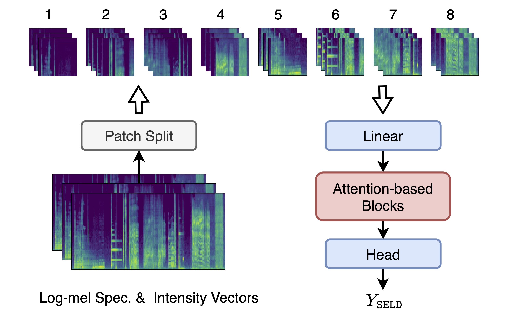
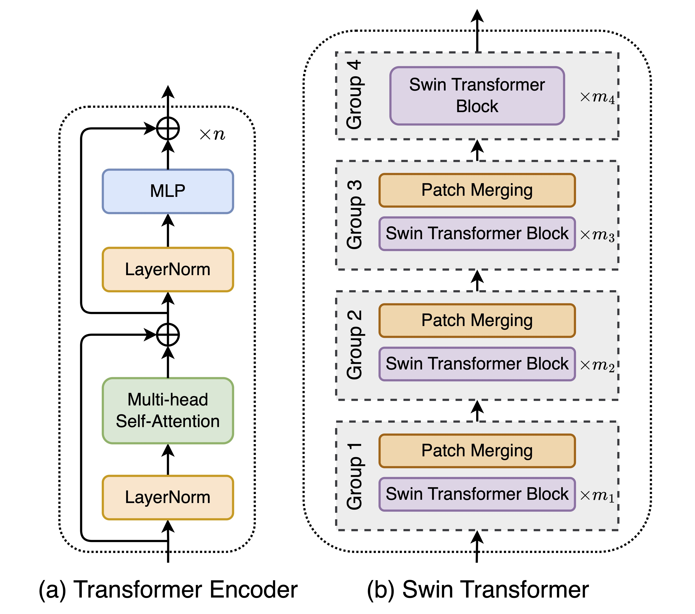
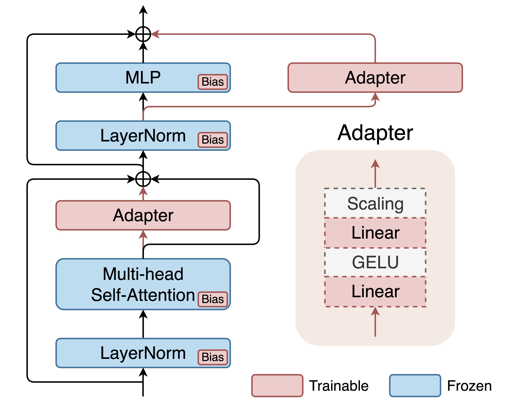

# PSELDNets: Pre-trained Neural Networks on Large-scale Synthetic Datasets for Sound Event Localization and Detection

## Table of contents
- [PSELDNets: Pre-trained Neural Networks on Large-scale Synthetic Datasets for Sound Event Localization and Detection](#pseldnets-pre-trained-neural-networks-on-large-scale-synthetic-datasets-for-sound-event-localization-and-detection)
  - [Table of contents](#table-of-contents)
  - [Introduction](#introduction)
  - [Environments](#environments)
  - [Download model checkpoints](#download-model-checkpoints)
    - [AudioSet-training checkpoints](#audioset-training-checkpoints)
    - [Synthetic-dataset-training checkpoints](#synthetic-dataset-training-checkpoints)
  - [Train PSELDNets from scratch](#train-pseldnets-from-scratch)
    - [Download the synthetic datasets](#download-the-synthetic-datasets)
    - [Quick train](#quick-train)
    - [Quick evaluate](#quick-evaluate)
  - [Transfer PSELDNets to downstream SELD datasets](#transfer-pseldnets-to-downstream-seld-datasets)
    - [DCASE 2021 Task 3](#dcase-2021-task-3)
    - [L3DAS22 Task 2](#l3das22-task-2)
    - [STARSS23](#starss23)
  - [AdapterBit Tuning](#adapterbit-tuning)
    - [Training with multi-channel clips](#training-with-multi-channel-clips)
    - [Training with monophonic clips](#training-with-monophonic-clips)
  - [FAQs](#faqs)
  - [Cite](#cite)
  - [Reference](#reference)


## Introduction

This repo contains code for our paper: **PSELDNets: Pre-trained Neural Networks on Large-scale Synthetic Datasets for Sound Event Localization and Detection** [1]. For more information, please read the paper [here](https://arxiv.org/abs/2411.06399).

The features of this method are:

* It synthesizes a large-scale SELD dataset designed to include numerous sound event instances and various acoustic environments.
* It introduces PSELDNets trained on the large-scale synthetic SELD dataset to develop a general-purpose model.
* PSELDNets are transferred to several downstream SELD tasks, where they surpass the performance of current state-of-the-art systems.
* It proposes a data-efficient fine-tuning technique to adapt to target SELD tasks using minimal resources.

The architecture of the purely attention-based network:

<p align="center">

</p>

The detailed architecture of the attention-based blocks:

<p align="center">

</p>

## Environments

The codebase is developed with Python 3.11.8. Install requirements are as follows:

```bash
pip install -r requirements.txt
```

We use the **lightning-hydra-template**, which is based on pytorch-lightning and hydra. You can configure hyper-parameters easily via the command line. More details can be found in this [link](https://github.com/ashleve/lightning-hydra-template).

## Download model checkpoints

All checkpoints need to be in the folder `./ckpts`.

### AudioSet-training checkpoints

All models utilize AudioSet-training checkpoints, including pre-trained parameters from [PANNs](https://github.com/qiuqiangkong/audioset_tagging_cnn), [HTS-AT](https://github.com/RetroCirce/HTS-Audio-Transformer) and [PaSST](https://github.com/kkoutini/PaSST). The details of corresponding hyper-parameters and checkpoint types can be found in `configs/model`. Download corresponding checkpoints in this [link](https://drive.google.com/drive/folders/1GHw-_NjW9UNyJ1rpxCpZ985SOb2RVyPA?usp=sharing) before training PSELDNets from scratch.

### Synthetic-dataset-training checkpoints

We provide the checkpoints of PSELDNets. Download corresponding checkpoints in [Google Drive](https://drive.google.com/drive/folders/1GHw-_NjW9UNyJ1rpxCpZ985SOb2RVyPA?usp=sharing) or [HuggingFace](https://huggingface.co/datasets/Jinbo-HU/PSELDNets) before transferring PSELDNets to downstream datasets.

## Train PSELDNets from scratch

### Download the synthetic datasets

The synthetic datasets are generated by this [tool](https://github.com/Jinbo-Hu/SELD-Data-Generator). For reproducibility, our synthetic datasets can be accessed at [Baidu Netdisk](https://pan.baidu.com/s/1T_5joJd1XDqJ9a2RUFV6dw?pwd=kvrv) and [HuggingFace](https://huggingface.co/datasets/Jinbo-HU/PSELDNets).

Download synthetic datasets and put these zip files in `./datasets`, modify directory names in the script first, and then run the following scripts to unzip these datasets:

```bash
bash scripts/unzip_datasets.bash
```

To process these synthetic datasets, please run:

```bash
bash scripts/prepare_DataSynthSELD.bash
```

The downloaded data looks like this:

```
datasets
├── train20000_ov1_1
│    ├── foa
│    |    └── ... (20000 .flac files)
│    ├── mic
│    |    └── ... (20000 .flac files)
│    ├── sum
│    |    └── ... (20000 .flac files) 
│    └── metadata
│         └── ... (20000 .csv files)
├── train20000_ov1_2
├── train10000_ov2_1
├── train10000_ov2_2
├── train3500_ov3_1
├── train3500_ov3_2
├── test1800_ov1
├── test900_ov2
├── test360_ov3
├── cls_indices_train.tsv # (id, mid, label, num_clip, total_duration)
└── cls_indices_test.tsv # (id, mid, label, num_clip, total_duration)
```

Note the `sum` folder contains mixed sound event clips without the convolution of SRIRs. These sound events clips are distributed across 1-minute clips and directly superimposed in the time domain.

### Quick train

The `configs/experiment` folder contains configurations of training.

```python
python src/train.py experiment=synth_maccdoa # the mACCDOA method (HTSAT by default)
# python src/train.py experiment=synth_accdoa # the ACCDOA method (HTSAT by default)
# python src/train.py experiment=synth_einv2 # the EINV2 method (HTSAT by default)
# python src/train.py experiment=synth_maccdoa model=passt # the mACCDOA method with PaSST
# python src/train.py experiment=synth_maccdoa model=crnn # the mACCDOA method with CNN14-Conformer
```

All models are trained on a single-card NVIDIA GeForce RTX 3090 GPU. The training takes around 1 - 2 days. If you came across **out of memory** error, then try to reduce the batch size in `configs/experiment` folder, or directly run:

```python
python src/train.py experiment=synth_maccdoa model.batch_size=1 # the mACCDOA method (HTSAT by default)
```

### Quick evaluate

You can evaluate our [checkpoints](https://drive.google.com/drive/folders/1GHw-_NjW9UNyJ1rpxCpZ985SOb2RVyPA?usp=sharing) on the *synthetic-test-set* via:

```python
# NOTE: Need to download corresponding checkpoints first

python src/infer.py experiment=synth_maccdoa ckpt_path=ckpts/mACCDOA-HTSAT-0.567.ckpt model.kwargs.pretrained_path=null # mACCDOA with HTS-AT
# python src/infer.py experiment=synth_accdoa ckpt_path=ckpts/ACCDOA-HTSAT-0.566.ckpt model.kwargs.pretrained_path=null # ACCDOA with HTS-AT
# python src/infer.py experiment=synth_einv2 ckpt_path=ckpts/EINV2-HTSAT-0.597.ckpt model.kwargs.pretrained_path=null # EINV2 with HTS-AT
# python src/infer.py experiment=synth_maccdoa ckpt_path=ckpts/mACCDOA-PaSST-0.562.ckpt model.kwargs.pretrained_path=null # mACCDOA with PaSST
# python src/infer.py experiment=synth_maccdoa ckpt_path=ckpts/mACCDOA-CNN14-Conformer-0.582.ckpt model.kwargs.pretrained_path=null # mACCDOA with CNN14-Conformer
```

## Transfer PSELDNets to downstream SELD datasets

### DCASE 2021 Task 3

You can download the dataset in this [link](https://zenodo.org/records/5476980), or directly run:

```bash
# NOTE: Need to set the path in the script first
bash scripts/prepare_dcase2021.bash
```

Put all files from sub folder (e.g., `dev-train-sony`) into the main folder (e.g., `foa_dev`). More details can be found in `scripts/prepare_dcase2021.bash`. The downloaded data looks like:

```
datasets
└── DCASE2021
     ├── foa_dev (600 .wav files which are divided into 6 folds)
     |    ├── fold1_room1_mix001.wav
     |    ├── fold1_room1_mix002.wav
     |    ├── ...
     |    └── fold6_room2_mix050.wav
     ├── foa_eval (200 .wav files, mix001.wav - mix200.wav)
     ├── mic_dev  (600 .wav files which are divided into 6 folds)
     ├── mic_eval (200 .wav files, mix001.wav - mix200.wav)
     ├── metadata_dev (600 .csv files which are divided into 6 folds)
     └── metadata_eval (200 .csv files, mix001.csv - mix200.csv)
```

Directly run the following command for fine-tuning:

```python
python src/train.py experiment=dcase2021/finetune_maccdoa_augmix1
```

### L3DAS22 Task 2

You can download the dataset in this [link](https://www.kaggle.com/datasets/l3dasteam/l3das22), or directly run:

```bash
# NOTE: Need to set the path in the script first.
# Refer to https://www.kaggle.com/docs/api for configuring the Kaggle command.
# The script will download all L3DAS22 datasets, so we recommend downloading only datasets of L3DAS22 Task 2 via the above link.
bash scripts/prepare_l3das22.bash
```

Put all files from sub folder (e.g., `L3DAS22_Task2_dev/L3DAS22_Task2_dev`) into a main folder (e.g., `data_train`). More details can be found in `scripts/prepare_l3das22.bash`.  The downloaded data looks like:

```
datasets
└── L3DAS22
     ├── data_train (1500 .wav files which are divided into 5 splits)
     |    ├── split0_ov1_0_A.wav
     |    ├── split0_ov1_0_B.wav
     |    ├── ...
     |    └── split4_ov3_49_B.wav   
     ├── data_test (300 .wav files, split5_ov1_0_A.wav - split5_ov3_49_B.wav)
     ├── labels_train (750 .csv files which are divided into 5 splits)
     └── labels_test (150 .csv files, split5_ov1_0.csv - split5_ov3_49.wav)
```

Directly run the following command for fine-tuning:

```python
python src/train.py experiment=l3das22/finetune_maccdoa_augmix
```

### STARSS23

You can download the dataset in this [link](https://zenodo.org/records/7880637), or directly run:

```bash
# NOTE: Need to set the path in the script first
bash scripts/prepare_starss23.bash
```

Put all files from sub folder (e.g., `dev-train-sony`) into the main folder (e.g., `foa_dev`). More details can be found in `scripts/prepare_starss23.bash`. The downloaded data looks like:

```
datasets
└── STARSS23
     ├── foa_dev
     |    └── ... (168 .wav files)
     ├── foa_eval
     |    └── ... (79 .wav files)
     ├── mic_dev
     |    └── ... (168 .wav files)
     ├── mic_eval
     |    └── ... (79 .fwav files)
     └──  metadata_dev
          └── ... (168 .csv files)
```

Directly run the following command for fine-tuning:

```python
python src/train.py experiment=starss23/finetune_maccdoa_augmix1
```

You can also download the official synthetic dataset provided by DCASE 2022 Challenge Task 3 at this [link](https://zenodo.org/records/6406873) for training.

## AdapterBit Tuning

SELD generally necessitates multi-channel audio inputs for source localization. By utilizing AdapterBit, PSELDNets can be more efficiently adapted to downstream SELD tasks using limited data, with a particular emphasis on the monophonic sound event clips.

A brief illustration of AdapterBit:

<p align="center">

</p>

### Training with multi-channel clips

Directly run the following command for full fine-tuning using multi-channel clips:

```python
python src/train.py experiment=l3das22/finetune_maccdoa_ov1 # Full fine-tuning
```

or AdapterBit tuning using monophonic clips:

```python
python src/train.py experiment=l3das22/finetune_maccdoa_ov1_adapterbit # AdapterBit Tuning
```

### Training with monophonic clips

Directly run the following command for full fine-tuning using monophonic clips:

```python
python src/train.py experiment=l3das22/finetune_maccdoa_ov1mono # Full fine-tuning
```

or AdapterBit tuning using monophonic clips:

```python
python src/train.py experiment=l3das22/finetune_maccdoa_ov1mono_adapterbit # AdapterBit Tuning
```

## FAQs
- If you have any questions, please email hujinbo2019@gmail.com or report an issue here.

- If you come across out of memory error, then try to reduce the batch size.

## Cite

[1] Jinbo Hu, Yin Cao, Ming Wu, Fang Kang, Feiran Yang, Wenwu Wang, Mark D. Plumbley, Jun Yang, "PSELDNets: Pre-trained Neural Networks on Large-scale Synthetic Datasets for Sound Event Localization and Detection" [arXiv:2411.06399](https://arxiv.org/abs/2411.06399), 2024. [URL](https://arxiv.org/abs/2411.06399)

[2] Jinbo Hu, Yin Cao, Ming Wu, Qiuqiang Kong, Feiran Yang, Mark D. Plumbley, and Jun Yang, “Sound event localization and detection for real spatial sound scenes: Event-independent network and data augmentation chains,” in Proc. Detect. Classification Acoust. Scenes Events (DCASE) Workshop, 2022, pp. 46–50. [URL](https://arxiv.org/abs/2209.01802)

[3] Jinbo Hu, Yin Cao, Ming Wu, Qiuqiang Kong, Feiran Yang, Mark D. Plumbley, and Jun Yang, “A track-wise ensemble event independent network for polyphonic sound event localization and detection,” in Proc. IEEE Int. Conf. Acoust., Speech Signal Process. (ICASSP), 2022, pp. 9196–9200. [URL](https://arxiv.org/abs/2203.10228)

## Reference

1. SELD Data Synthesis: [https://github.com/Jinbo-Hu/SELD-Data-Generator](https://github.com/Jinbo-Hu/SELD-Data-Generator)
2. HTS-AT: [https://github.com/RetroCirce/HTS-Audio-Transformer](https://github.com/RetroCirce/HTS-Audio-Transformer)
3. PaSST: [https://github.com/kkoutini/PaSST](https://github.com/RetroCirce/HTS-Audio-Transformer)
4. PANNs: [https://github.com/qiuqiangkong/audioset_tagging_cnn](https://github.com/qiuqiangkong/audioset_tagging_cnn)
5. lightning-hydra-template: [https://github.com/ashleve/lightning-hydra-template](https://github.com/ashleve/lightning-hydra-template)
